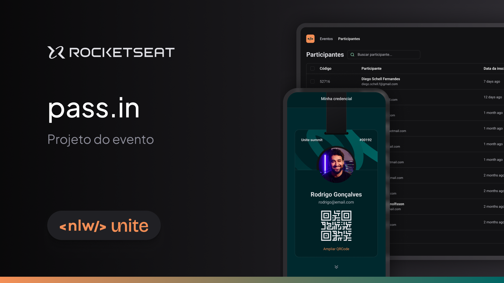
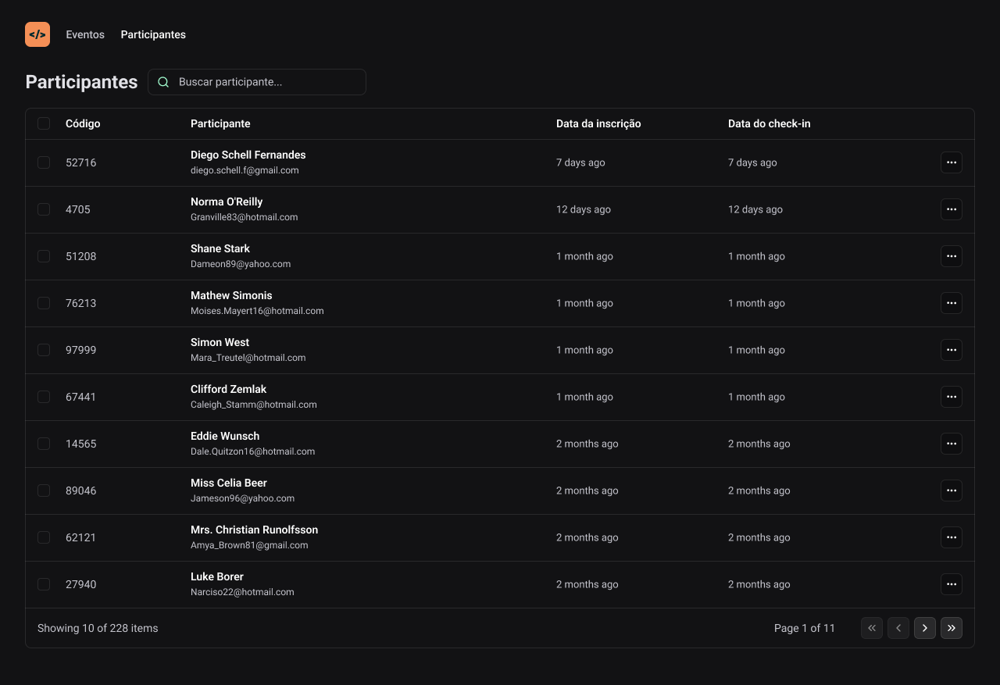

# pass.in web

[#Rocketseat #NlwUnite](https://www.rocketseat.com.br/)

## 💻 Projeto

O pass.in é uma aplicação web que gerencia participantes de eventos. O projeto foi desenvolvido durante a Next Level Week Unite da Rocketseat.  

A principal funcionalidade é a utilização de __url state__ de forma nativa para que a listagem com filtros seja mantida mesmo após o recarregamento da página.

## 🔖 Layout

Você pode visualizar o layout do projeto através [desse link](https://www.figma.com/community/file/1356738933008624188)





## 🧪 Como executar

Clone o projeto e acesse a pasta do mesmo.

```bash
$ git clone
$ cd pass-in-web
```

Para iniciá-lo, siga os passos abaixo:
```bash
# Instalar as dependências
$ npm install

# Iniciar o projeto
$ npm run dev:mock

# O servidor inciará em <http://localhost:50792>
```

## 🚀 Tecnologias

Esse projeto foi desenvolvido com as seguintes tecnologias:

- React JS + Vite + Typescript
- TailwindCSS
- Zod
- Dayjs
- Fakerjs
- MSW (Mock Service Worker)
- Playwright (em breve)
